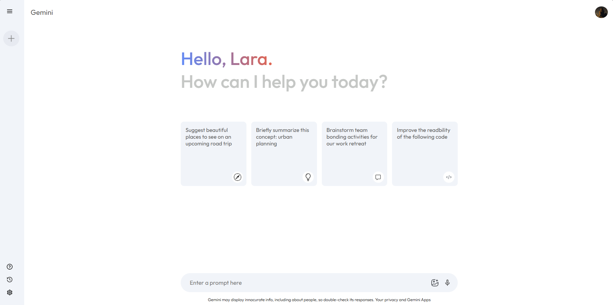
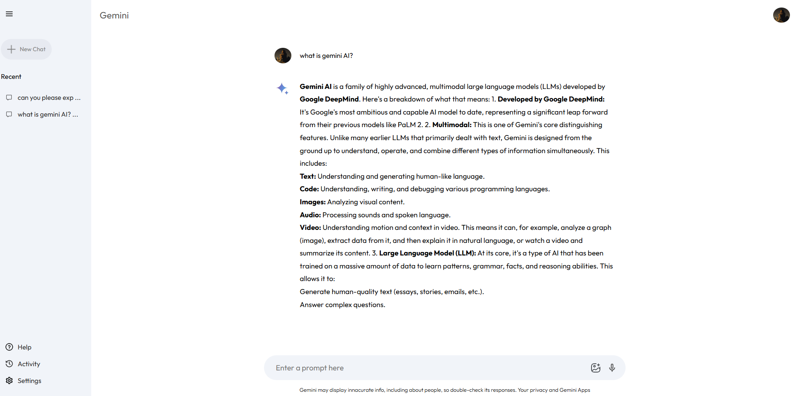

<!-- Title -->
<div align="center">
  <h1>Gemini AI Clone</h1>

  <p>
    A Gemini AI-inspired web app built with JavaScript, React, Tailwind CSS, and NPM. It features a sleek UI and interactive AI chat experience, replicating the look and feel of Google's Gemini interface.
  </p>
  
<!-- About the Project -->
## :star2: About the Project

<!-- Screenshots -->
### :camera: Screenshots
</div>

<div align="center"> 
  
  
</div>

<!-- TechStack -->
### :space_invader: Tech Stack

<a href="https://www.typescriptlang.org/">Typescript</a>
<a href="https://nextjs.org/">Next.js</a>
<a href="https://reactjs.org/">React.js</a>
<a href="https://vite.dev/">Vite</a>
<a href="https://tailwindcss.com/">TailwindCSS</a>

API
<a href="https://ai.google.dev/">Gemini API for devs</a>

<!-- Features -->
### :dart: Features

- Interactive AI chat interface – Simulates real-time responses in a clean, minimal UI.
- Responsive design – Built with Tailwind CSS for seamless display on all devices.
- Component-based architecture – Powered by React for modular and scalable development.

<!-- Env Variables -->
### :key: Environment Variables

To run this project, you will need to add the following environment variables to your .env file

`API_KEY`

<!-- Getting Started -->
## 	:toolbox: Getting Started

<!-- Prerequisites -->
### :bangbang: Prerequisites

Make sure you have **Node.js** and **npm** installed on your machine.

<!-- Run Locally -->
### :running: Run Locally 

Clone the project

```bash
  git clone https://github.com/larajmorningstar/gemini-clone.git
```

Go to the project directory

```bash
  cd gemini-clone
```

Install dependencies

```bash
  npm install
```

Start the server

```bash
  npm run dev
```


<!-- Usage -->
## :eyes: Usage

This project uses Gemini API for devs. Using the 2.5 flash model


```javascript
async function runChat(prompt) {
  const response = await ai.models.generateContent({
    model: "gemini-2.5-flash",
    contents: prompt,
  });

  console.log(response.text);
  return response.text;
}
```
